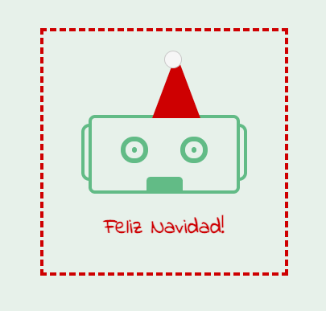

# Pure CSS Images

After going through the CSS basics I wanted to better understand how `position: absolute` and `position: relative` work. What better way to do this than by making a project 😊

Digging a bit deeper I realized that I might be able to build a CSS image using purely CSS. I've seen [Ania Kubów](https://twitter.com/ania_kubow) [robot](https://codepen.io/stefi23/full/BaLWydw) in one of her [Scrimba](https://scrimba.com/) courses and after checking the code I slowly made sense of it. The next step was do do a little tutorial on Pure CSS Images which I found [here](https://medium.com/coding-artist/a-beginners-guide-to-pure-css-images-ef9a5d069dd2) and I was ready to go.

Hope this will be beginning of more such projects.

## Robot Christmas Card

Design was inspired by the [Robot House](http://robothousebcn.com/) coffeeshopt in Barcelona. It was the place I went to regularly to get my takeaway coffee disconnect from my challenging job I had.

You can find it on [Codepen](https://codepen.io/stefi23/pen/YzGZEYg) too.

Special thanks to [Michael Mangialardi](https://twitter.com/michaelmangial1) who made drawing with pure css less indimidating.
